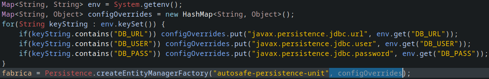
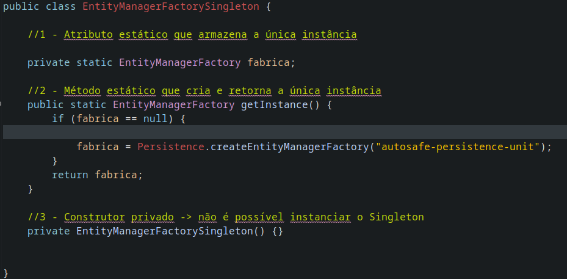
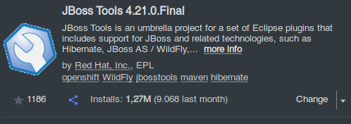
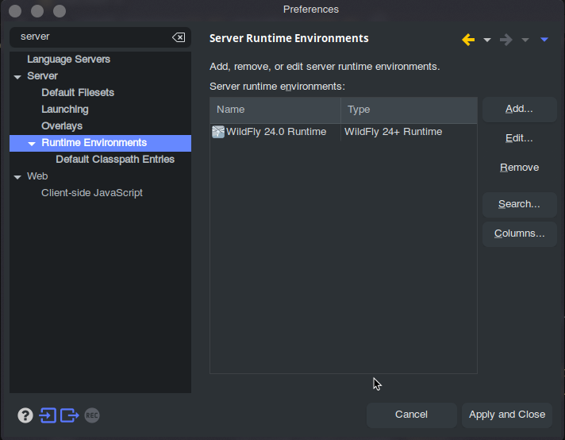
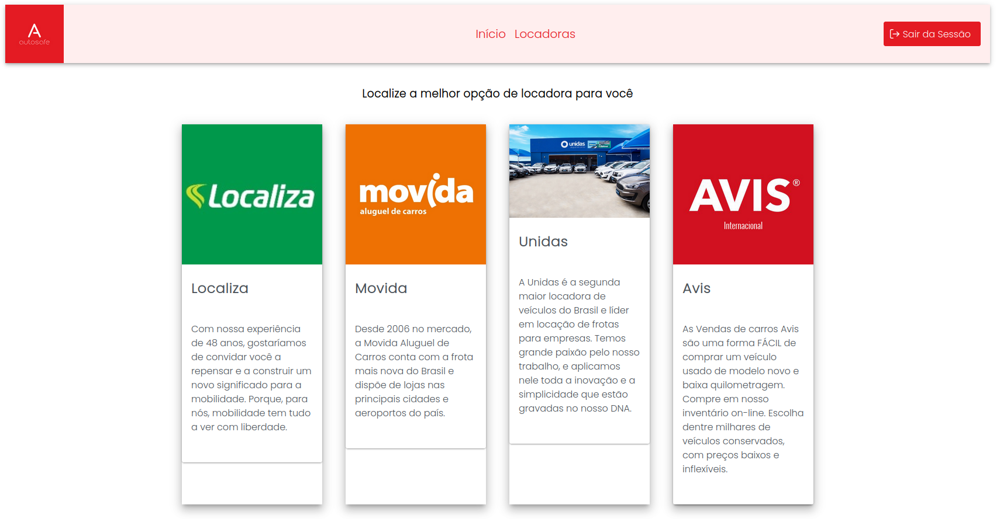
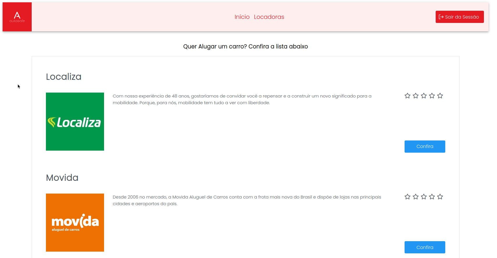
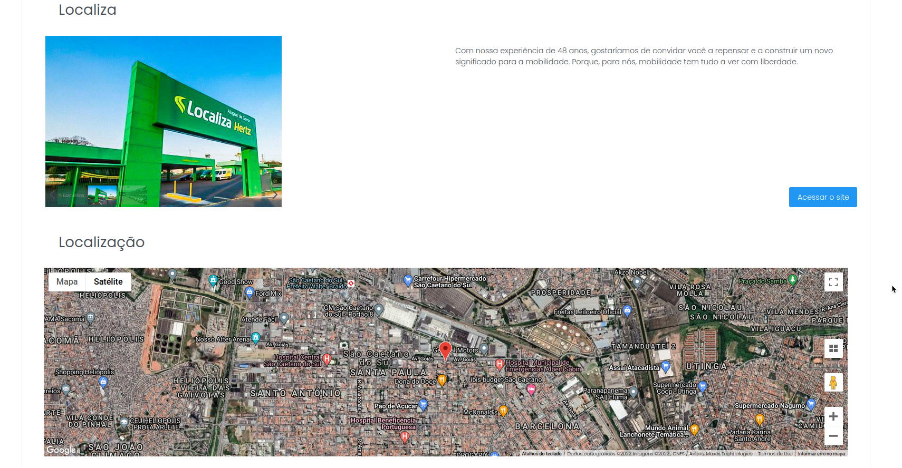

# Projeto : AutoSafe

Projeto acadêmico simples com o objetivo de criar um site de pesquisa por locadoras de carros com avaliações de usuários e acesso aos sites oficiais para comparação.

### Acesse o projeto [aqui](http://autosafegs.herokuapp.com/index.xhtml).

## Tecnologias

1. JSF
2. JSTL
3. JPA
4. HIBERNATE
5. PRIMEFACES
6. WIlDFLY(JBOSS)

## Como Executar o Projeto ?

- JDK e JRE Atualizados.
- Eclipse instalado (não conheço outro método de rodar projetos em JSF + Wildfly sem o Eclipse).
- Maven Instalado na máquina.
- Configurar o seu banco MySQL(ou outro)

  - Alterar os valores dentro da classe no diretório <code>/src/main/java/br/com/fiap/singleton/EntityManagerFactorySingleton.java</code>
  - apagar o trexo de código abaixo e o que estiver marcado em azul :

    

    Vai ficar assim :

    

  - Procure pelo Percistence.xml que fica no diretório <code>/src/main/resources/META-INF/percistence.xml</code>
  - troque os valores de acesso de acordo com as do seu banco de dados;

- Instale o Eclipse
- Instale o JBoss Tools

  

- Instale o Server Wildfly pelo Eclipse

  

### Execute adicionando o projeto dentro do WildFly e Acesse a porta de acesso (normalmente 8080) que o projeto irá executar.

---

## Imagens do Projeto

 

 

 

